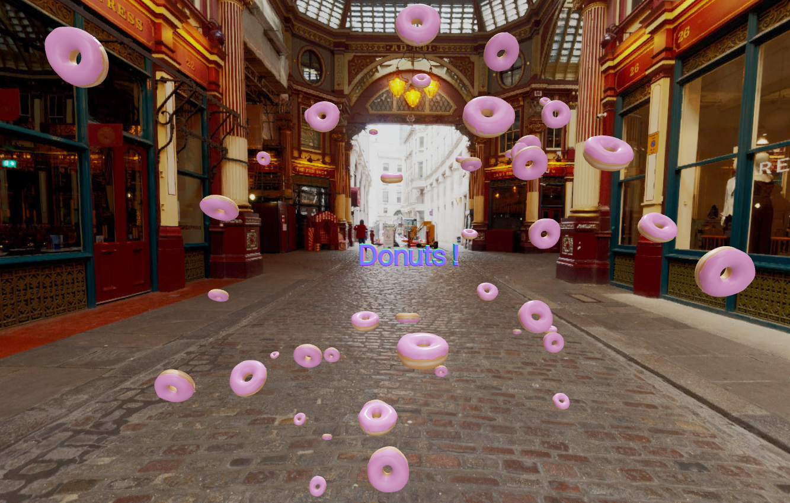
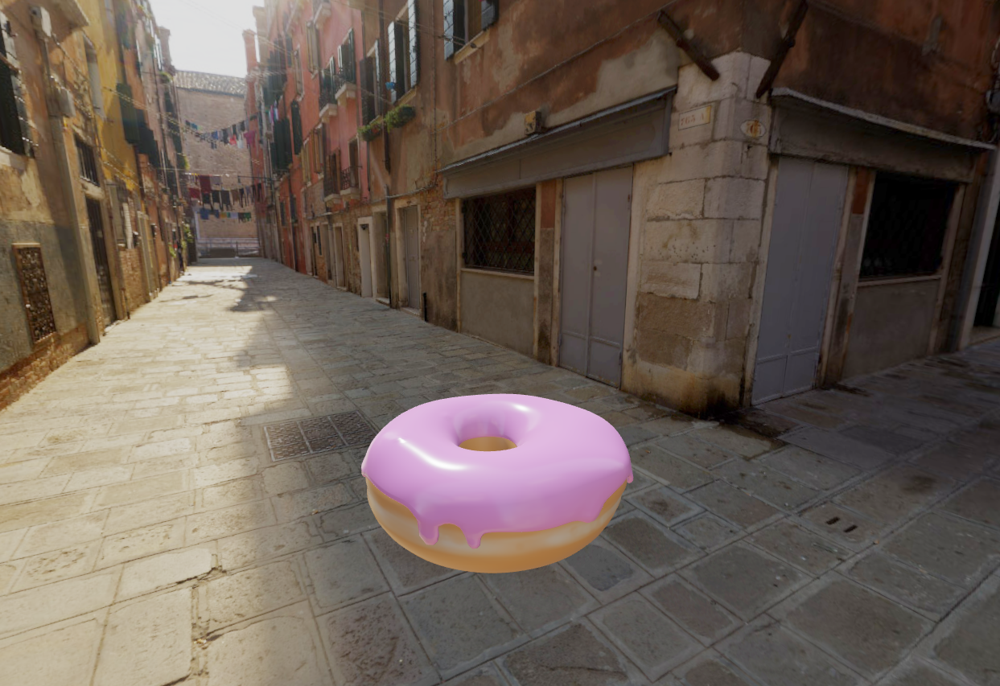

# Website Link: [Click Here](https://3-d-donut.vercel.app/)

### Install dependencies (only the first time)
npm install

### Run the local server at localhost:8080
npm run dev

### Build for production in the dist/ directory
npm run build

## Website Description 
- Built using Three.js
- Donut model was created in Blender
- Can move the camera around with left & right click
- Use scroll wheel to zoom in & out

## Want a Free 3D Donut Model?
- Download: [Click Here](https://github.com/KevinThomasNY/3D-Donut/tree/master/static/BlenderDonut)
- The file is in .glb format
- You can open the file in Blender or other 3D software
-  The model is 100% free and you can use it without restrictions

